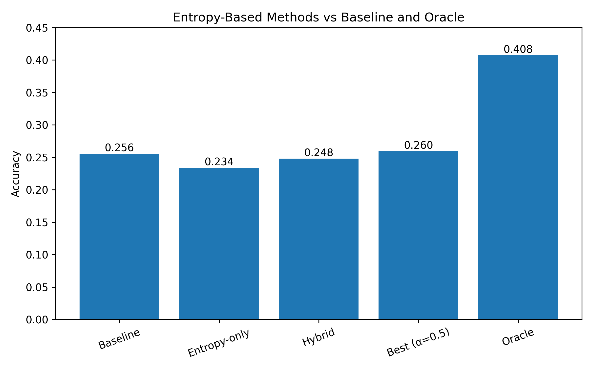

# Entropy as Hallucinogen
Entropy-based hallucination detection works —barely. A study on its limits using TruthfulQA

## On the Limits of Entropy-Based Hallucination Mitigation

This repository evaluates whether token-level entropy can be used to detect or reduce hallucinations in language models.

The experiments are run on TruthfulQA (multiple-choice) using FLAN-T5.

---

## Problem

Entropy is widely used as a proxy for uncertainty.
A common assumption is:

> higher entropy → more likely to be wrong

This work tests whether that assumption actually improves decision-making.

---

## Setup

* Model: FLAN-T5 (base)
* Task: Multiple-choice QA (TruthfulQA)
* Scoring: sequence log-likelihood
* Entropy: token-level average entropy of generated answer
* Evaluation: choose option with highest score

We test:

1. Baseline (log-probability only)
2. Entropy-only selection
3. Hybrid rule (switching based on entropy)
4. Linear combination (tuned α)
5. Oracle (best of logprob vs entropy)

---

## Results

| Method          | Accuracy |
| --------------- | -------- |
| Baseline        | 0.2557   |
| Entropy-only    | 0.2342   |
| Hybrid (rule)   | 0.2481   |
| Best (α = 0.50) | 0.2595   |
| Oracle          | 0.4076   |

## Results Overview

Additional:

* Entropy–correctness correlation: **0.087**
* Correct answers have slightly **higher entropy** than wrong ones

---

## Observations

* Entropy contains **some signal**, but it is weak
* Entropy alone performs worse than baseline
* Rule-based switching degrades performance
* Tuned combination yields negligible improvement (~+0.4%)
* There is a large gap between achievable performance (oracle) and entropy-based methods

---

## Conclusion

Entropy is not a reliable signal for hallucination mitigation in this setting.

It correlates weakly with correctness but does not translate into useful decision rules.

---

## Reproduce

View and run at https://www.kaggle.com/code/blackoutcreed/entropy-as-hallucinogen
or import the ipynb into kaggle notebook or IDE of your own choice (ensure cuda suppprt)

## Limitations

- Evaluated on a single model (FLAN-T5 base)
- Multiple-choice setting (not free-form generation)
- Entropy measured at token level only

## Notes

* Results are stable across runs
* No prompt engineering or instruction bias is used
* Evaluation uses likelihood-based scoring (not generation)

---

## License

Apache 2.0

